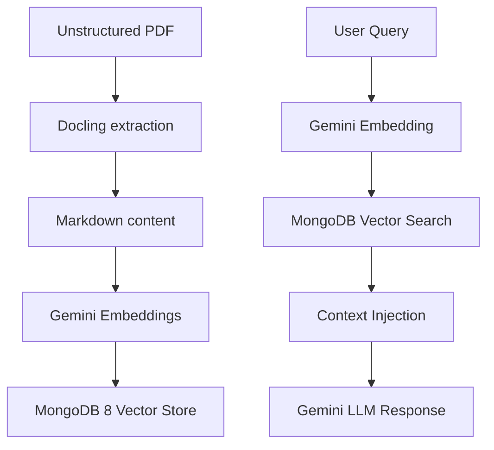

# System Architecture

The RAG System is designed as a modular pipeline that transforms unstructured data into actionable knowledge.

## Pipeline Overview

## Components

### 1. Extraction (Docling)
- **Tool**: [Docling](file:///Users/adamo/Documents/Rag_system/docs/techinical-reference/docling.md)
- **Role**: Convert complex PDFs into clean Markdown.
- **Rationale**: Markdown preserves structure better than raw text for embedding.

### 2. Embedding (Gemini)
- **Tool**: [Google Gemini Embedding API](https://ai.google.dev/gemini-api/docs/embeddings)
- **SDK**: `google-genai`
- **Implementation**: [embedding.py](file:///Users/adamo/Documents/Rag_system/embedding.py)
- **Role**: Generate high-quality 768-dimensional (or higher) vectors from Markdown chunks.
- **Rationale**: World-class semantic understanding and seamless integration with Gemini LLMs.

### 3. Storage & Retrieval (MongoDB 8)
- **Tool**: MongoDB 8 with Vector Search.
- **Role**: Store document metadata alongside their vector representations.
- **Rationale**: MongoDB 8's native vector support simplifies the stack by combining NoSQL flexibility with specialized search capabilities.

### 4. Generation (Gemini)
- **Tool**: Gemini 1.5 Pro/Flash.
- **Role**: Generate responses based on retrieved context.
- **Rationale**: Large context windows and superior reasoning capabilities.
